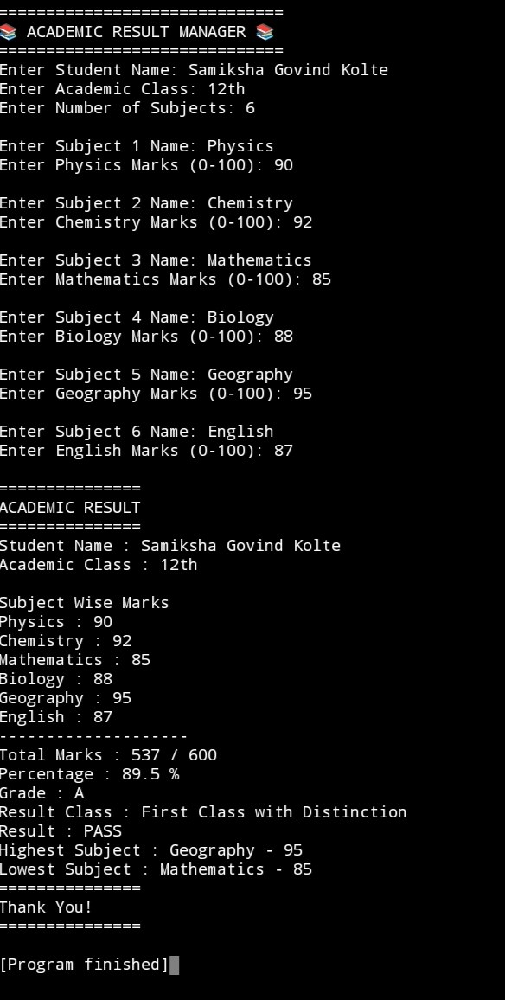

# 📚 Academic Result Manager

Welcome to Samiksha's Academic Result Manager! 🎓

This is a simple Python project that helps calculate a student's Total Marks, Percentage, Grade, and Pass/Fail Result quickly and accurately.

## ✨ Features

📌 Enter Student Name
📌 Enter Marks for Multiple Subjects
📌 Calculate Total Marks Automatically
📌 Calculate Percentage
📌 Display Grade (A, B, C, D, F)
📌 Show Pass/Fail Status
📌 Beginner-Friendly Python Code

## 🎯 Project Objective

This project was created to practice Python basics such as variables, user input, conditional statements, and arithmetic operations.

## 🛠️ Technologies Used
 • 🐍 Python 3

## ▶️ How to Run

1. Install Python.
2. Open the project.
3. Run the Python file.

## 📸 Screenshot

## 📚 What I Learned
 • Variables
 • Lists
 • Loops
 • Functions
 • User Input
 • If-Else Statements
 • Arithmetic Operations

## 👩‍💻 Author
Samiksha Kolte

## 📄 License

This project is licensed under the MIT License. See [LICENSE](LICENSE) for details.

## 🚀 Future Improvements

💾 Save student records to a file
- 📝 Edit and delete student records
- 📊 Generate performance reports
- 🌐 Develop a web version using HTML,      CSS, and Flask
- 🗄️ Store data in a database
